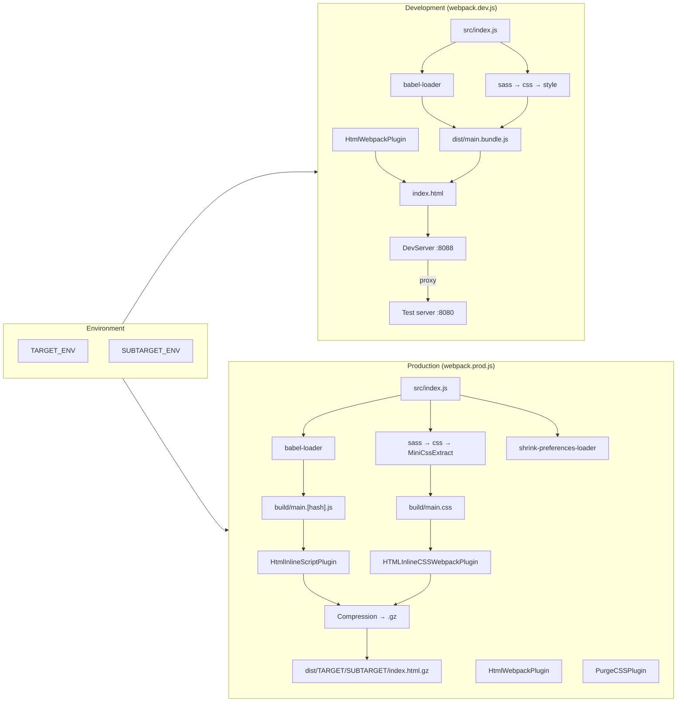
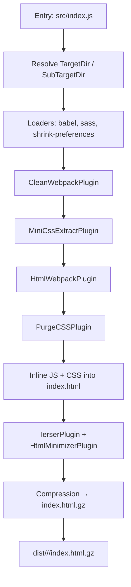
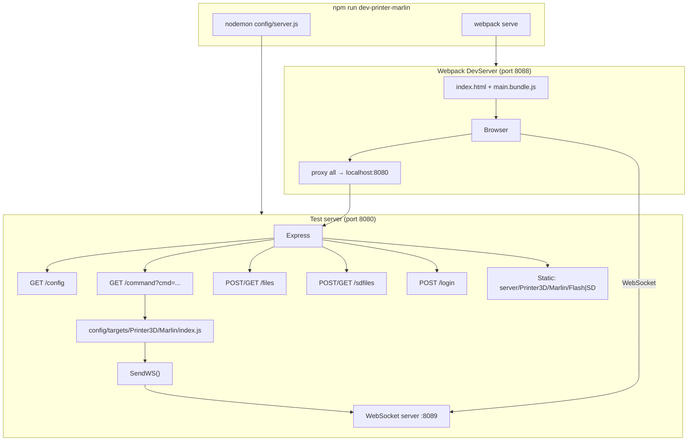
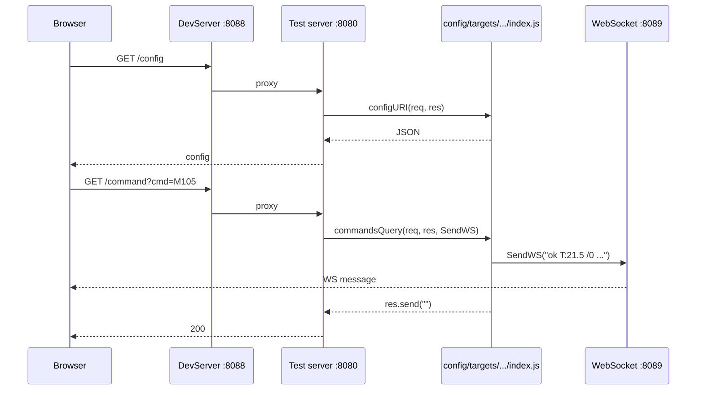

# Config: Webpack flow and test server

This document describes the **webpack build flow** and the **test server** used during development. It is intended for maintenance and onboarding.

---

## Flow diagrams (Mermaid)

### Webpack: dev vs prod

### Webpack production pipeline (simplified)

### Test server and dev session

### Request flow (browser → firmware sim)

---

## 1. Webpack flow

### Environment and entry

- **Environment variables** (set by npm scripts or `cross-env`):
  - `TARGET_ENV`: machine family — `Printer3D`, `CNC`, `SandTable`
  - `SUBTARGET_ENV`: firmware — e.g. `Marlin`, `Marlin-embedded`, `Repetier`, `Smoothieware` (Printer3D); `GRBL`, `grblHAL` (CNC/SandTable)
- **Single entry**: `src/index.js` (same for dev and prod).
- **Resolve aliases** (both dev and prod):
  - `TargetDir` → `src/targets/<TARGET_ENV>` (e.g. `src/targets/Printer3D`)
  - `SubTargetDir` → `src/targets/<TARGET_ENV>/<SUBTARGET_ENV>` (e.g. `src/targets/Printer3D/Marlin`)

The app imports from `TargetDir` and `SubTargetDir`, so the bundle only includes the chosen target/subtarget code.

### Files involved

| File | Role |
|------|------|
| **webpack.dev.js** | Development build: dev server (port 8088), proxy to test server (8080), source maps, CSS extracted to `[name].css`, no minification. |
| **webpack.prod.js** | Production build: minify, PurgeCSS, inline JS/CSS into HTML, gzip to `dist/<target>/<subtarget>/index.html.gz`, optional bundle analyzer. |
| **shrink-preferences-loader.js** | Webpack loader applied only to `preferences.json` under `src/targets/`. Shortens keys (e.g. `id`→`i`) to reduce bundle size. The runtime expands them via `src/components/Helpers/preferencesKeys.js`. |

### Development build (webpack.dev.js)

1. **Entry**: `src/index.js`.
2. **Output**: `dist/[name].bundle.js` (no hash).
3. **DevServer**:
   - Port **8088** (UI).
   - **Proxy**: all requests forwarded to `http://localhost:8080` (test server).
   - **Static**: `config/server/public` (optional static assets; directory may not exist).
   - **historyApiFallback**: SPA routing (serve index.html on 404).
4. **Loaders**:
   - **babel-loader** (preact preset) for `.js`/`.jsx`.
   - **sass-loader** → **css-loader** → **style-loader** for `.scss` (source maps on).
5. **Plugins**: `MiniCssExtractPlugin`, `HtmlWebpackPlugin` (template `src/index.html`, inject scripts/styles).
6. **Mode**: `development` (no minification, no drop_console).

So: `npm run dev-printer-marlin` starts webpack-dev-server on 8088 and (via concurrently) the test server on 8080. The UI talks to the firmware simulator through the proxy.

### Production build (webpack.prod.js)

1. **Entry**: `src/index.js`.
2. **Output**: `build/[name].[fullhash].js` (then inlined; see below).
3. **Loaders**:
   - **sass** → **css** → **MiniCssExtractPlugin.loader** (no style-loader).
   - **babel-loader** (preact).
   - **shrink-preferences-loader** for `src/targets/**/preferences.json`.
4. **Plugins (order matters)**:
   - `CleanWebpackPlugin`: wipe `build/`.
   - `MiniCssExtractPlugin`: emit `[name].css`.
   - `HtmlWebpackPlugin`: one `index.html` with script/link tags.
   - `PurgeCSSPlugin`: scan `src/**/*.js`, `src/**/*.jsx`, `src/index.html`; safelist tooltip, modal, dropdown, toast, etc.
   - If **ANALYZE ≠ 1**: `HtmlInlineScriptPlugin` (inline all JS into `index.html`), `HTMLInlineCSSWebpackPlugin` (inline CSS), then `Compression` (gzip → `build/../dist/<target>/<subtarget>/index.html.gz`, delete non-gz HTML).
   - If **ANALYZE=1**: `BundleAnalyzerPlugin` only (no inlining/gzip), so the treemap shows the real main chunk.
5. **Optimization**:
   - **TerserPlugin**: `drop_console: true`, `drop_debugger: true`.
   - **HtmlMinimizerPlugin**: minify HTML (collapse whitespace, minify CSS/JS).
6. **Mode**: `production`.

Result: a single file **dist/Printer3D/Marlin/index.html.gz** (or other target/subtarget) containing inlined, minified JS and CSS. No separate chunk files in deployment.

### Scripts (package.json)

- **Dev**: `dev-<system>-<firmware>` (e.g. `dev-printer-marlin`) → sets `TARGET_ENV`/`SUBTARGET_ENV`, runs `server` (nodemon `config/server.js`) and `front` (webpack serve with `webpack.dev.js`).
- **Build**: `printer-marlin`, `cnc-grbl`, etc. → same env vars, `webpack --config config/webpack.prod.js`.
- **Analyze**: `ANALYZE=1` with the same env and prod config to get the bundle treemap (no inlining).

### Other config scripts (not webpack)

- **buildtemplate.js** / **buildlangpack.js**: build language packs (merge base + target + subtarget translations, output to `languages/`). Used by npm scripts like `buildlangpack`.
- **checkpack.js**: compare a language pack to a reference template (key coverage).
- **pack.js**: minify + gzip a single HTML file (e.g. extension); `npm run package target=<path>`.

---

## 2. Test server (firmware simulator)

### Role

The **test server** (`config/server.js`) runs on **port 8080** and simulates the HTTP + WebSocket behaviour of an ESP3D-backed firmware so the WebUI can be developed without a real device.

### Architecture

- **Express** (port 8080): static files, upload, and API routes.
- **WebSocket server** (port **8089**): pushes “serial-like” messages (e.g. temperature, file list) to the client.
- **Target/subtarget**: chosen via `TARGET_ENV` and `SUBTARGET_ENV` (same as webpack). The server:
  - Serves files from **`server/<target>/<subtarget>/`** (e.g. `server/Printer3D/Marlin/`), with **Flash** and **SD** subdirs (created if missing).
  - Loads **`config/targets/<target>/<subtarget>/index.js`**, which exports:
    - `commandsQuery(req, res, SendWS)` — handles `/command` and drives WebSocket replies.
    - `configURI(req, res)` — handles `/config` (e.g. preferences/capabilities).
    - `getLastconnection`, `hasEnabledAuthentication` — auth/session (optional).
  - Implements **`/files`**, **`/sdfiles`** (list/upload/delete/create dir) against `server/<target>/<subtarget>/Flash` and `SD`.
  - Implements **`/login`** (if auth enabled), **`/updatefw`** (stub).

So: **one server process**, one **target/subtarget** per run; behaviour is switched by the loaded `config/targets/.../index.js`. For protocol and response format, see esp3d.io and the firmware docs; the test server behaviour is defined in `config/targets/<target>/<subtarget>/index.js` and `config/server.js`.

### What the target module does (e.g. Marlin)

- **commandsQuery**: parses `req.query.cmd` or URL, and:
  - Returns or sends via `SendWS()` canned responses for a set of commands (e.g. `M114`, `M20`, `M105`, `G28`, `SIM:...`, `PING`).
  - May maintain state (e.g. temperatures, positions) and reply with realistic strings (e.g. `ok T:21.5 /0 B:20 /0 ...`).
- **configURI**: returns JSON for `/config` (connection, features, etc.) so the UI can bootstrap.
- **loginURI** (if used): login handler for the target.

Each target (Marlin, Repetier, Smoothieware, GRBL, grblHAL) has its own **config/targets/…/index.js** with command set and response format adapted to that firmware.

### DevServer static

- **webpack.dev.js** sets `devServer.static.directory` to **`config/server/public`**. If that folder exists, dev server serves it at the root; otherwise it has no effect. The **main** backend is the proxy to port 8080 (and WS to 8089).

---

## 3. Test server: possible improvements

These ideas can make the simulator **smarter** and **more useful** for development and debugging.

### 3.1 Command coverage and discoverability *(partially implemented)*

- **Central list of supported commands**: Per-target list in JSON (e.g. `config/targets/Printer3D/Marlin/commands.json`) with `cmd`, `description`, and `exampleResponse`. Reduces duplication and documents what the UI can rely on. *(Done for Marlin; other targets can add a `commands.json` in the same way.)*
- **Fallback handler**: Unknown commands no longer fall through silently. If no target handler sends a response, the server responds with `error:unknown command\n` (HTTP 200) and, when `MOCK_VERBOSE=1`, logs the command. *(Implemented in `config/server.js`; each target’s `commandsQuery` no longer ends with a default `ok`.)*
- **Optional “verbose” mode**: Set env **`MOCK_VERBOSE=1`** to log every incoming `/command` URL and every WebSocket message received. Example: `MOCK_VERBOSE=1 npm run dev-printer-marlin`.

### 3.2 Stateful, consistent behaviour *(partially implemented for Marlin)*

- **Shared state**: In `config/targets/Printer3D/Marlin/index.js`, a `state.position` object (X, Y, Z, E) is updated by `G0`/`G1` and read by `M114`. Temperatures were already in a shared object and updated by `M104`/`M140`/`M141`; `M105` reads from it. So multiple panels and refreshes stay consistent for position and temperatures.
- **SD file list from disk**: The server passes a `context` object to `commandsQuery(req, res, SendWS, context)` with `getSDList(path)` and `getFlashList(path)` that read from `server/<target>/<subtarget>/SD` and `Flash`. The Marlin target uses `context.getSDList("/")` for `M20`, `M20 L`, and `M20 1:` when available, so the listed files match the real SD directory. Other targets can adopt the same pattern (optional 4th argument).

### 3.2bis Mock strategy by target type

**Printer3D (Marlin, Repetier, etc.)**

- **Stateful (priority)**:
  - **Temperatures**: simulation de chauffe/refroidissement (déjà en place : `updateTemperature`, cibles M104/M140/M141, lecture M105). Important pour que l’UI reflète des courbes réalistes.
  - **Position**: state partagé mis à jour par G0/G1, lu par M114 (déjà en place pour Marlin).
- **Reste des commandes** : garder les réponses simulées existantes (M20, M115, M503, ESP*, etc.) ; pas besoin de tout rendre stateful.

**CNC (GRBL, grblHAL)**

- **Plus complexe** : le **status** (poll `?` ou équivalent) regroupe tout en une ligne : position (MPos, WCO), pins (Pn:), broche (M3/M4/M5), liquide de refroidissement (M7/M8/M9), etc. L’objectif est d’avoir un **état partagé** (position, broche on/off, coolant, pins) mis à jour par les commandes (G0/G1, M3/M4/M5, M7/M8/M9, etc.) et dont la **réponse status** est dérivée à chaque poll, pour que l’UI reste cohérente.
- **Commandes ESP** (ESP800, ESP400, ESP401, ESP420, etc.) : conserver les réponses simulées actuelles (JSON / texte), comme pour Printer3D.

### 3.1bis Gzip file preference

- **Prefer .gz when present**: For any GET request under the Flash root (main app or **extensions**), the server first checks for the corresponding `.gz` file in `server/<target>/<subtarget>/Flash/`. For example: `toto.html` → `toto.html.gz`, `/` → `index.html.gz`, and for extensions e.g. `/ext/MyExtension/index.html` → `Flash/ext/MyExtension/index.html.gz`. If the `.gz` exists, it is served with `Content-Encoding: gzip` and the appropriate `Content-Type`; otherwise the uncompressed file is served. This lets you test with **final built files** (gzipped) as in production, both for the main UI and for extensions.

### 3.3 Scenarios and presets

- **Presets** (e.g. “printing”, “idle”, “error”): small scripts or configs that set temperatures, position, and maybe a “job running” flag so the UI can be tested in different states without clicking through everything.
- **Optional “demo” mode**: auto-advance state (e.g. temperature ramping, position changes) on a timer to stress-test the UI.

### 3.4 Documentation and maintenance

- **README or section in this file** under `config/` that lists:
  - Ports (8080 HTTP, 8089 WS, 8088 dev UI).
  - How to add a new command in a target (which file, how to register and respond).
  - How to add a new target/subtarget (new dir under `config/targets/`, new entry in server’s loader).
- **One place** that lists all routes (e.g. `/command`, `/config`, `/files`, `/sdfiles`, `/login`, `/updatefw`) and whether they are target-specific or shared.

### 3.5 Alignment with real firmware

- **Periodic sync** with ESP3D/ESP3DLib: compare response formats (e.g. `/config` JSON, `M20`/`M114`/`M105` strings) and adjust mocks so the same UI code works on device and in dev.
- **Optional “record/replay”**: record a sequence of requests/responses from a real device and replay them in the test server for regression testing (advanced).

### 3.6 Ease of use

- **Single command** to start “UI + server” for a given target (already there via `dev-<system>-<firmware>`); document it and, if useful, add a default target when no env is set.
- **Health check**: e.g. `GET /ping` or `/health` returning 200 so scripts or IDE can wait for the server to be up before opening the browser.
- **CORS/WS**: if the UI is ever served from another origin, the server may need explicit CORS and WS origin checks (currently same-origin via proxy).

Implementing even a subset of these (e.g. fallback handler, verbose logging, and a short “supported commands” list per target) would already make the test server more predictable and easier to maintain.
